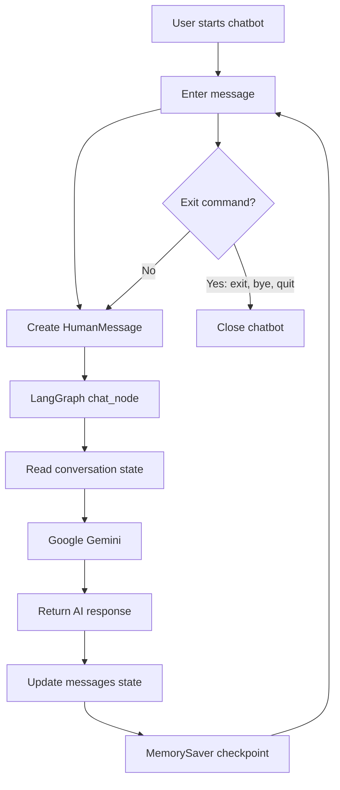
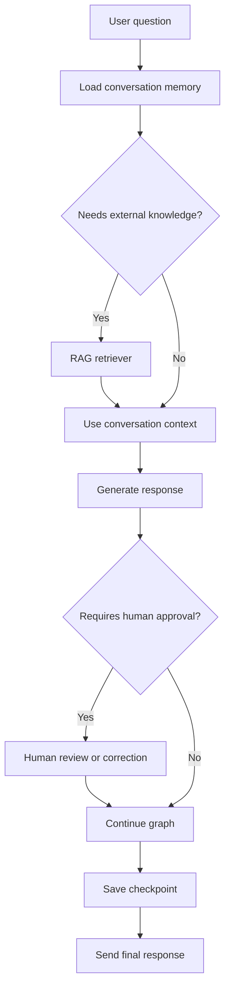

# LangGraph Chatbot

This folder contains a command-line chatbot built with **LangGraph** and **Google Gemini**.

The chatbot is also a learning project. I am using it to understand how LangGraph can build reliable, stateful, and agentic applications step by step.

## LangGraph Learning Goals

I am using this chatbot to learn these concepts:

| Concept | Learning focus | Status |
|---|---|---|
| Persistence | Save and restore graph state with checkpoints and thread IDs | In progress |
| Memory | Keep conversation history available across turns | Implemented with `MemorySaver` |
| RAG | Retrieve relevant documents before generating an answer | Planned |
| Human-in-the-loop | Pause a workflow for human approval or input | Planned |
| Graph state | Pass structured state between LangGraph nodes | Implemented |
| Messages | Manage `HumanMessage` and AI responses in state | Implemented |
| Streaming | Display model output as it is generated | Planned |

The goal is to start with a simple chatbot and gradually turn it into a practical learning lab for LangGraph and Agentic AI.

## What It Demonstrates

- Creating a LangGraph state with a `messages` history
- Sending conversation messages to an LLM node
- Using `MemorySaver` for checkpoint-based conversation persistence
- Reusing a `thread_id` to maintain one conversation thread
- Building an interactive Node.js CLI with `readline`

## Setup

From the project root, install dependencies:

```bash
npm install
```

Create a `.env` file in the project root and add your Gemini API key:

```env
GEMINI_API_KEY=your_api_key_here
```

Keep the `.env` file private. It is excluded from git.

## Run

From the project root:

```bash
node Chatbot/LLM_chatbot.js
```

Then type a message at the `You:` prompt. The chatbot responds through the LangGraph workflow.

## Exit

Type any of these commands to stop the chatbot:

```text
exit
bye
quit
```

## Implementation Flow



The current configuration uses the `user-1` thread. A different `thread_id` can be used to keep separate conversation histories.

## Planned Agentic Flow

The following diagram shows how I plan to extend this chatbot while learning more LangGraph patterns:



## Concept Notes

### Persistence and Memory

`MemorySaver` stores graph checkpoints in memory while the application is running. The `thread_id` identifies which conversation state should be reused for later messages. This is the first step toward durable persistence with a database-backed checkpointer.

### RAG

RAG (Retrieval-Augmented Generation) will allow the chatbot to search a document collection and provide relevant context to Gemini before generating an answer.

### Human-in-the-Loop

Human-in-the-loop workflows will allow the graph to pause at a chosen step, collect human feedback or approval, and then resume from the saved state.

## File

- `LLM_chatbot.js` - Interactive LangGraph chatbot with Gemini and checkpoint memory

## Future Improvements

- Accept a thread ID from the user or command line
- Add streaming responses
- Add error handling for missing API keys and failed requests
- Add persistent storage beyond in-memory checkpoints
